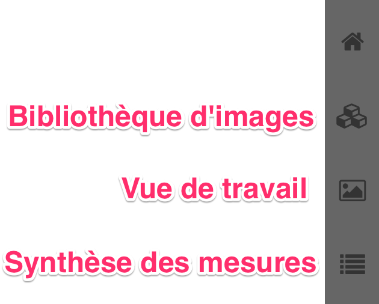

Chères testeuses, chers testeurs,

Merci d'avoir accepté de tester le Collaboratoire 2.

La version 0.1.0 de l'application est téléchargeable :
- [ici, pour Mac](https://github.com/Amleth/collaboratoire2/releases/download/0.1/Collaboratoire2-0.1.0-mac.zip)
- [là, pour Windows](https://github.com/Amleth/collaboratoire2/releases/download/0.1/Collaboratoire2-0.1.0-win.zip)

Dans ce premier test, nous vous demandons de commenter l'ergonomie générale en matière d'organisation des images et d'annotation. Cette version ne sauvegarde pas les mesures et annotations : à chaque fois que vous relancerez l'application, vous repartirez dans un état vierge. La sauvegarde des annotations sera activée une fois les premiers tests effectués.

Gilles Bertin (```gilles.bertin(at)cnam.fr```) a rédigé un [document d'aide illustré](../Collaboratoire%202%20-%20Aide.pdf), qui documente l'ensemble des écrans de l'application et des fonctions proposées à ce jour. Nous vous invitons à le consulter avant de lancer le Collaboratoire 2.

Pour ce premier test, nous vous proposons le cheminement suivant :

- Dans la vue où sont listées vos images (c'est la *Bibliothèque*), créez quelques tags, et distribuez les sur les images.
- Cliquez sur un tag pour restreindre la liste d'images. Ceci permet de constituer une sélection de travail.
- Passer dans la vue de travail, et testez les outils de mesure linéaire (règle) et d'annotation (rectangle & point d'intérêt).
- Adjoignez du texte à vos annotations, onglet « Annotations » du panneau situé à gauche.
- Testez l'export CSV dans la vue *Synthèse des mesures*. Cette vue est très insuffisante pour l'instant, car l'ensemble des mesures linéaires sont présentées sans possibilité de filtrage. Le champ ```target type```et des tags au niveau des annotations seront bientôt proposés pour affiner les résultats. Note : le document d'aide vous fait savoir que chaque pression sur le bouton d'export CSV génère un fichier daté dans le dossier ```collaboratoire2-userdata```situé à la racine de votre dossier utilisateur·trice.

<p align="center">
  
</p>

La prochaine séquence de test, à venir en décembre, portera sur :
- l'import d'images avec leurs métadonnées à partir d'[https://explore.recolnat.org/](https://explore.recolnat.org/)
- le tagging des annotations (niveau plus fin que l'image)
- le filtrage des mesures & annotations dans la vue *Synthèse* par types & tags

Nous vous invitons à nous communiquer vos impressions, critiques et demandes par courriel (```gilles.bertin(at)cnam.fr``` + ```thomas.bottini(at)gmail.com```).